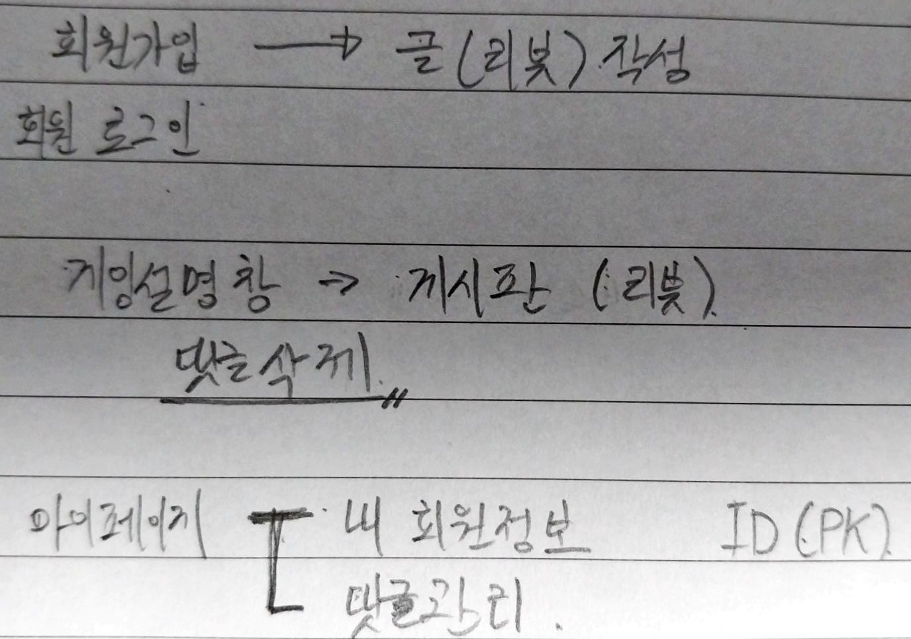

- 절차지향 프로그램언어
  
  - C언어
    
    - 기계어중심
    
    - 문법 복잡, 컴파일 가능

- 객체지향 언어
  
  - JAVA, C++
    
    - C보다 쉬움, 컴파일 가능

------------------------

### 프로젝트 웹페이지 구성

기존 구성에서 유저를 추가하게 되면서 로그인/회원가입 페이지를 새롭게 추가하게 되면서 DB에 user테이블 및 board테이블 추가

----------------

**플랫폼화 사업**

ex)구글, 애플, 싸이월드, 배달의 민족 등등등

개발자의 시선은 하나에 꽃혀있음

뭔가 만들어달라하면 자기 입맛대로 만듬

그래서 더 성공(돈)할려면 기획자의 시선을 가져야함 (폭넓게)

API

ex)카카오, 구글, 등등의 로그인 연동

api서비스 하는 이유

본인들의 플랫폼만 사용하게끔 하기 위함

헬스 플랫폼

헬스트레이너들 운동 방식이나 식단을 체계화해서 웹페이지를 만들던가 해서 공유
