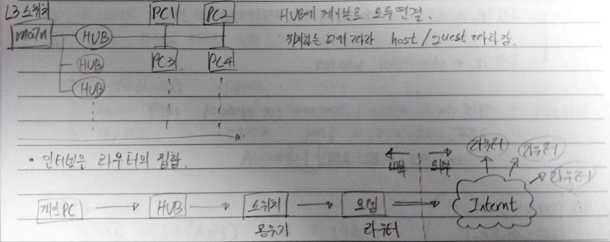
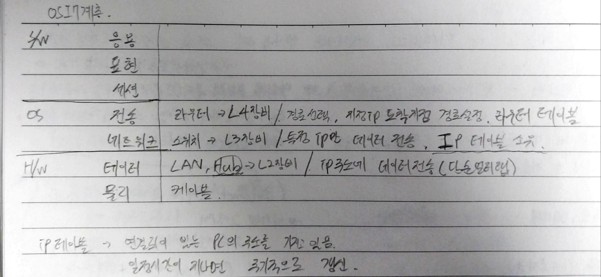

아웃/인바운드 = 내/외부로 내보내거나 받아올떄 쓰는 조건(규칙)

설정 > 방화벽 > 방화벽 상태 확인(고급설정) > 파일 및 프린터 공유 (ICMPv4) >규칙사용

ICMPv4가 허용이 안되면 가상머신에서 ping도달 불가

IMCP = ip주소로 데이터 전송하는 형식

----------------------------------------------

- 게이트웨이
  
  - 서브넷 마스크 자릿수의 첫번째 (내 ip주소의 1번)
  
  - 서브넷 24일떄
    
    - 192.168.219.1

| DNS서버 주소 |                |
| -------- | -------------- |
| KT       | 168.126.63.1   |
| SK       | 210.220.163.82 |
| LG       | 164.124.101.2  |

